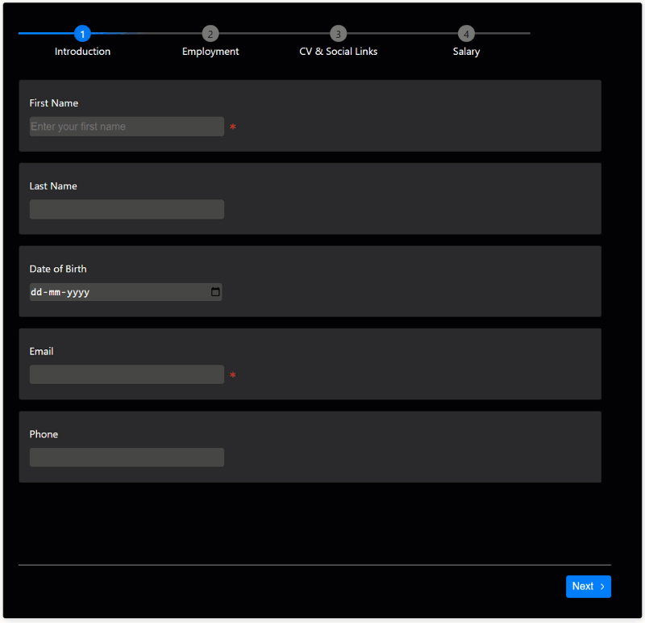

<p align="center">
  <a href="" rel="noopener">
 </a>
</p>

[](/LICENSE)

[](https://snyk.io/test/github/prabhuignoto/react-wizardry)
[](/Version)
<!-- [](https://deepsource.io/gh/prabhuignoto/react-wizardry/?ref=repository-badge) -->

</div>

> react-wizardry is a data-driven smart wizard component for creating powerful forms with in built validations.

---



<h2>Features</h2>

- ⚡Data driven API
- ✅In built validations
- 💪Built with Typescript
- 💡Intuitive stepper interface
- 🎨Customizable Theme

<h2>Table of Contents</h2>

- [📦 Installation](#-installation)
- [🚀 Getting Started](#-getting-started)
- [⚙️ Properties](#️-properties)
- [Page](#page)
- [Form field](#form-field)
- [Form field types](#form-field-types)
- [Accessing the wizard data](#accessing-the-wizard-data)
- [🎨 Theme](#-theme)
- [CodeSandbox examples](#codesandbox-examples)
- [⛏️ Built With](#️-built-with)
- [✍️ Authors](#️-authors)

## 📦 Installation

Install the package via `npm` or `yarn`

```sh
npm install react-wizardry
```

```sh
yarn add react-wizardry
```

## 🚀 Getting Started

The component takes a pages collection and renders the pages in a stepper interface.The pages appear in the order they are passed in the pages collection.

The example shows a simple wizard with two pages.

```jsx
<Wizard
  pages={[
    {
      title: "Introduction",
      fields: [
        {
          label: "Name",
          name: "name",
          type: "text",
          isRequired: true,
        },
      ],
  },
  {
    title: "Contact",
    fields: [
      {
        label: "Email",
        name: "email",
        type: "email",
        isRequired: true,
      },
    ],
 }
},
```

## ⚙️ Properties

| Name                          | Description                                                                                                                                                        |
| :---------------------------- | :----------------------------------------------------------------------------------------------------------------------------------------------------------------- |
| `strict`                      | Enables validation rules for all input types in every page of the wizard. The component prevents the user from moving forward unless the errors fixed on the step. |
| `theme`                       | Theme object for customized styling                                                                                                                                |
| `highlightFieldsOnValidation` | Highlights the fields when the validation fails or succeeds                                                                                                        |
| `pages`                       | Collection of [Page](#Page) object                                                                                                                                 |
| `onFinish`                    | Callback executed on final step. The callback receives an object with the data for each page                                                                       |

## Page

Page object is at the core of the wizard. Page object is used to define the title, description, fields, and validation rules for a page.

| Name     | Description                                                          | Type     |
| :------- | :------------------------------------------------------------------- | :------- |
| onChange | Callback executed when any of the Form field value changes(Internal) | Function |
| fields   | Fields of the Page                                                   | Array    |
| isActive | Indicates whether the page is active or not                          | Boolean  |
| title    | Title of the Page                                                    | String   |
| state    | State of the Page. can be `NOT_VALIDATED`, `SUCCESS`, `FAIL`,        | String   |

> Every page is in the `NOT_VALIDATED` state by default.

Here is an examples how to define pages in the wizard. We are defining two pages with two fields.

```jsx
<Wizard
  pages={[
    {
      title: "Introduction",
      fields: [
        {
          label: "First Name",
          name: "firstName",
          type: "text",
          isRequired: true,
        },
        {
          label: "Last Name",
          name: "lastName",
          type: "text",
          isRequired: true,
        },
      ],
  },
  {
    title: "Contact",
    fields: [
      {
        label: "Email",
        name: "email",
        type: "email",
        isRequired: true,
      },
      {
        name: "Phone number",
        label: "Phone",
        type: "phone",
        isRequired: true,
      },
    ],
 }
},
```

## Form field

Form field represents an input field in the wizard. Form field is used to define the label, type, validation rules, and other properties.

| Name          | Description                         | Type      |
| :------------ | :---------------------------------- | :-------- |
| name          | Name of the Field                   | string    |
| isRequired    | Marks the field as required         | boolean   |
| validate      | Enables validation for the field    | boolean   |
| type          | Type of Field                       | InputType |
| label         | Label for the field                 | string    |
| selectOptions | Use this prop when type is "select" | Array     |

> Fields marked as required are automatically validated. If you set `isRequired` to `false` and `validate` to `true`, the wizard will validate and flag the errors, but the step itself will not be marked as invalid.

In the example below we are defining two fields and making them required.

```jsx
<Wizard
  pages={[
    {
      title: "Introduction",
      fields: [
        {
          label: "First Name",
          name: "firstName",
          type: "text",
          isRequired: true,
        },
        {
          label: "Last Name",
          name: "lastName",
          type: "text",
          validate: true,
        },
      ],
  },
]}
```

Here only the First Name field is required. The last name field will be validated if the user enters a value.

## Form field types

Form field supports the following types:

- **text**: Text input field
- **email**: Email input field
- **phone**: Phone input field
- **number**: Number input field
- **password**: Password input field
- **textarea**: Textarea input field
- **select**: Select input field
- **checkbox**: Checkbox input field
- **radio**: Radio input field
- **datetime**: DateTime input field
- **file**: File input field

All the above input types comes with inbuilt validation.

## Accessing the wizard data

The `onFinish` callback receives the wizard data with each key representing a page.

For the getting started example, the `onFinish` callback will receive an object with the following structure:

```js
{
  "introduction": {
    "firstName": "<entered name>",
    "lastName": "<entered name>",
  },
  "contact": {
    "email": "<entered email id>";
    "phone": "<entered phone number>",
  }
}
```

## 🎨 Theme

Customize the look and feel of the Wizard through the `theme` object.


| Name                | Description                                              | Data Type | Default |
| :------------------ | :------------------------------------------------------- | :-------- | :------ |
| background          | Background color of the wizard                           | string    | #f8f8f8 |
| fail                | Colour to signify failed state                           | string    | #de1738 |
| formFieldBackground | Background color of the Form field                       | string    | #ffffff |
| primary             | Primary colour. This color will be the predominant color | string    | #007fff |
| success             | Colour to signify a success state                        | string    | #1db954 |
| textColor           | Colour of all texts                                      | string    | #000000 |
| formFieldBorder     | Border colour of the form field                          | string    | #dcdcdc |
| inputBackground     | Background color of the native input control             | string    | #e8e8e8 |
| inputTextColor      | Fore color of the text inside the native input control   | string    | #000000 |
| tabColor            | Colour of the tab                                        | string    | #f8f8f8 |
| tabLineColor        | Colour of the line that runs through all the tabs        | string    | #ccc    |

Here is a short example of how to use the theme object.

```jsx
<Wizard
  theme={{
    primary: "#007fff",
    background: "#000",
    textColor: "#fff",
    formFieldBackground: "#282828",
    formFieldBorder: "#000",
    success: "#519259",
    fail: "#cf352e",
    inputBackground: "#464646",
    inputTextColor: "#fff",
    tabLineColor: "#464646",
    tabColor: "#7d7d7d",
  }}
/>
```

## CodeSandbox examples

  1. [Basic Wizard](https://codesandbox.io/s/react-wizardy-simple-form-vu3y6b)
  2. [Complex Wizard](https://codesandbox.io/s/react-wizardy-multi-forms-io9ey5)
  3. [Wizard with custom theme](https://codesandbox.io/s/react-wizardy-theme-hzf5bx)

## ⛏️ Built With

- [React](http://reactjs.org) - A JavaScript library for building user interfaces.
- [Typescript](https://www.typescriptlang.org) - TypeScript is a typed superset of JavaScript that compiles to plain JavaScript.
- [SCSS](https://sass-lang.com) - A CSS preprocessor and compiler.
- [Webpack](https://webpack.js.org) - Webpack is a module bundler that packs multiple modules into a single file.
- [Eslint](https://eslint.org) - ESLint is a linter for JavaScript and JSX.
- [Prettier](https://prettier.io) - Prettier is a tool to format code.

## ✍️ Authors

- [@prabhuignoto](https://github.com/prabhuignoto) - Idea & Initial work